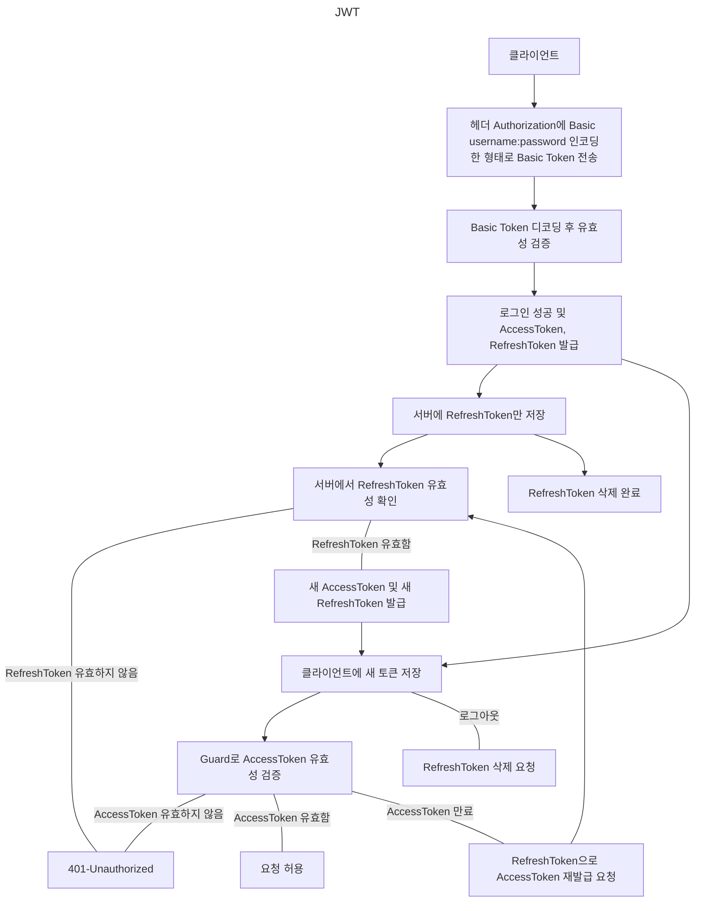

```mermaid
---
title: JWT
---

flowchart TD
client[클라이언트] --> authHeader[헤더 Authorization에 Basic username:password 인코딩한 형태로 Basic Token 전송] --> decodeBasicToken[Basic Token 디코딩 후 유효성 검증]
decodeBasicToken --> login[로그인 성공 및 AccessToken, RefreshToken 발급]
login --> server[서버에 RefreshToken만 저장]
login --> cli[클라이언트에 AccessToken, RefreshToken 둘 다 저장]
cli --> guard[Guard로 AccessToken 유효성 검증]
guard-- AccessToken 유효하지 않음 ---401-Unauthorized
guard-- AccessToken 유효함 --- allow[요청 허용]
guard-- AccessToken 만료 ---refreshRequest[RefreshToken으로 AccessToken 재발급 요청]
refreshRequest --> d[서버에서 RefreshToken 유효성 확인]
server --> d
d-- RefreshToken 유효하지 않음 ---401-Unauthorized
d-- RefreshToken 유효함 ---dsds[새 AccessToken 및 새 RefreshToken 발급]
dsds --> cli[클라이언트에 새 토큰 저장]
cli -- 로그아웃 --- logoutRequest[RefreshToken 삭제 요청]
server --> logoutSuccess[RefreshToken 삭제 완료]
```